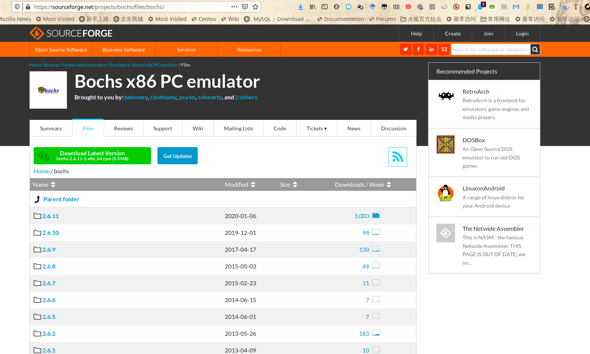
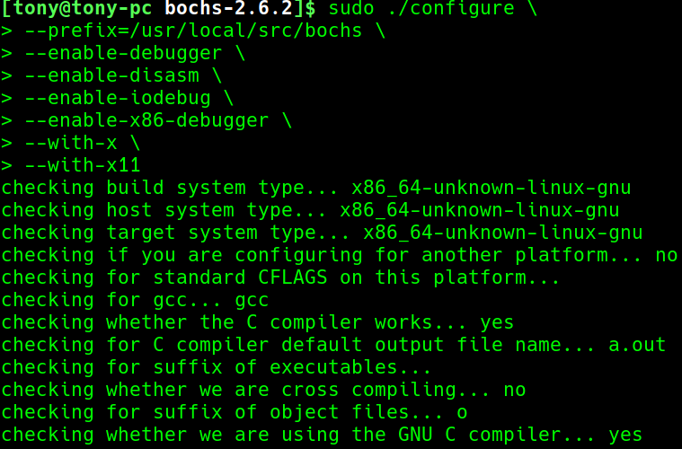
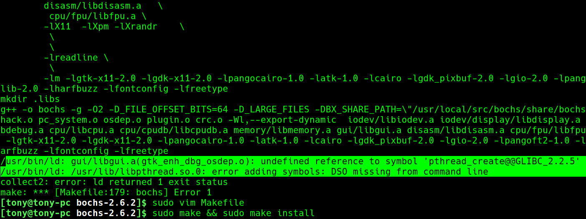
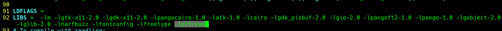
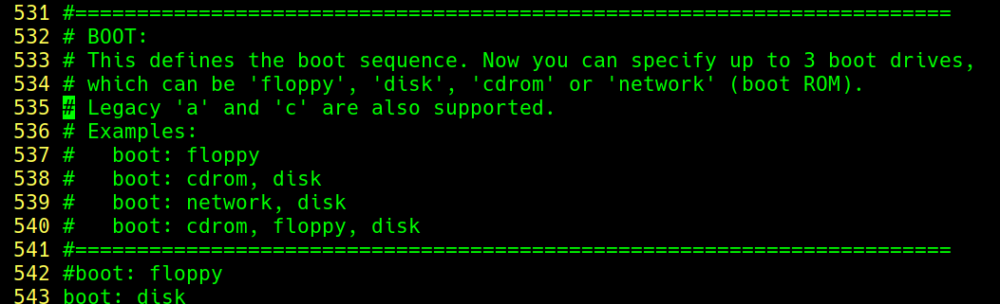
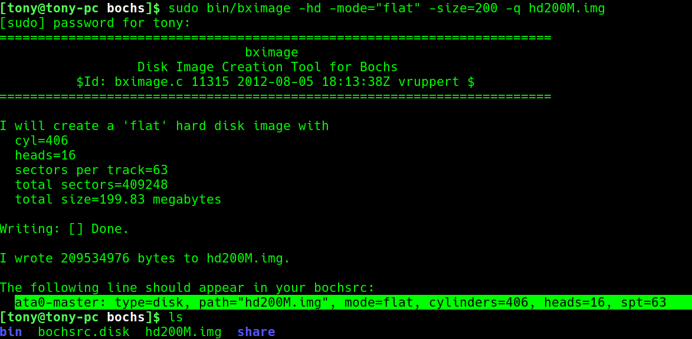
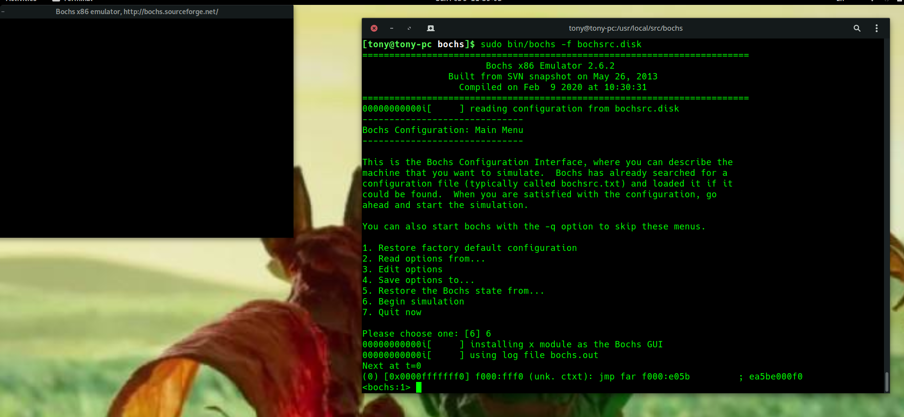

# chapter1部署工作环境

## 一、安装bochs
[下载bochs](https://sourceforge.net/projects/bochs/files/bochs/)



```bash
$ sudo ./configure \
> --prefix=/usr/local/src/bochs \
> --enable-debugger \       #打开bochs自己的调试器
> --enable-disasm \         #是 bochs 支持反汇编
> --enable-iodebug \        #启用I/O接口调试器
> --enable-x86-debugger \   #支持x86调试器
> --with-x \                #使用xwindow
> --with-x11                #使用 X11图形用户接口
```


### 可能出错


这种报错是因为 ```pthread```库 不是Linux系统默认库，连接时需要使用静态库 ```libpthread.a```,这样在使用 ```pthread_create()``` 创建线程，以及调用 ```pthread_atfork()```函数建立 fork处理程序时，需要连接该库。

在Makefile的92行新加 ```-lpthread```，重新```make```



## 二、配置Bochs
安装目录下有样本文件

```share/doc/bochs/bochsrc-sample.txt```



[配置文件——bochsrc.disk](bochsrc.disk)

启动设备,写一块磁盘


## 三、运行Bochs
```
$> ./start.sh
```


## 四、可以运行Env下的0.README.sh文件
运行脚本