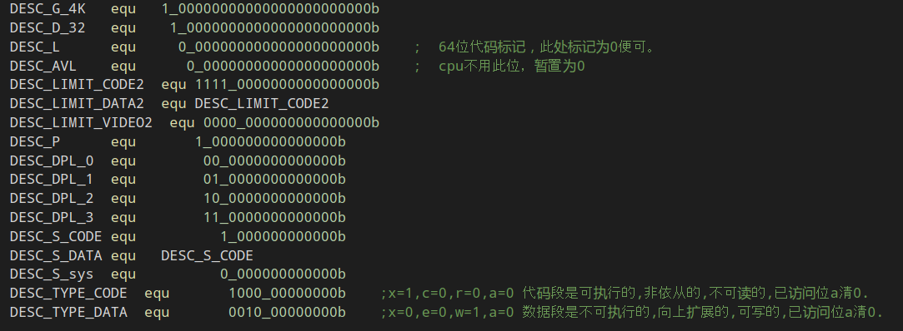
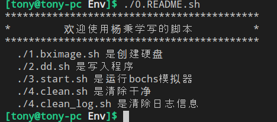

# 用软件工程的方式完成操作系统

## 一、格式规范
### 1.符号名
符号名采用```DESC_字段名_字段相关信息```


## 二、目录规范
### 1.运行环境
在目录```0.部署工作环境```中有bochs的源码包,[点击具体安装步骤](0.部署工作环境/README.md)

在每个目录下```Env```已经写好运行脚本和镜像如有问题运行
```bach
./0.README.sh
```


### 2.代码
每个目录下的```code```文件夹，编译直接使用```make```，具体信息看```Makefile```

### 3.运行结果
在每个目录下都有```.gif```,```.webm```格式的演示动画。

### 4.原理分析
有的过程是需要通过```bochs```的debug功能实现，所以使用```.png```截图展示